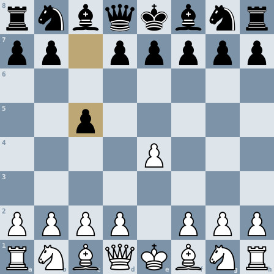

# Play ArhanPassant on GitHub

Everyone plays White, together, against the engine on this one board. Pick a move below: GitHub opens an issue with the move filled in, you press **Submit new issue**, and the engine answers within a few minutes, on your issue and on this page.

**Game 1, move 1, White to move.** A new game: the first move is yours.

## Your move

| Piece | Moves |
|---|---|
| Knight | [Na3](https://github.com/arhancanli/arhanpassant/issues/new?title=play%3A%20b1a3&body=Game%201%2C%20position%200.%20Press%20Submit%20new%20issue%3B%20the%20engine%20replies%20here%20within%20a%20few%20minutes.) · [Nc3](https://github.com/arhancanli/arhanpassant/issues/new?title=play%3A%20b1c3&body=Game%201%2C%20position%200.%20Press%20Submit%20new%20issue%3B%20the%20engine%20replies%20here%20within%20a%20few%20minutes.) · [Nf3](https://github.com/arhancanli/arhanpassant/issues/new?title=play%3A%20g1f3&body=Game%201%2C%20position%200.%20Press%20Submit%20new%20issue%3B%20the%20engine%20replies%20here%20within%20a%20few%20minutes.) · [Nh3](https://github.com/arhancanli/arhanpassant/issues/new?title=play%3A%20g1h3&body=Game%201%2C%20position%200.%20Press%20Submit%20new%20issue%3B%20the%20engine%20replies%20here%20within%20a%20few%20minutes.) |
| Pawn | [a3](https://github.com/arhancanli/arhanpassant/issues/new?title=play%3A%20a2a3&body=Game%201%2C%20position%200.%20Press%20Submit%20new%20issue%3B%20the%20engine%20replies%20here%20within%20a%20few%20minutes.) · [a4](https://github.com/arhancanli/arhanpassant/issues/new?title=play%3A%20a2a4&body=Game%201%2C%20position%200.%20Press%20Submit%20new%20issue%3B%20the%20engine%20replies%20here%20within%20a%20few%20minutes.) · [b3](https://github.com/arhancanli/arhanpassant/issues/new?title=play%3A%20b2b3&body=Game%201%2C%20position%200.%20Press%20Submit%20new%20issue%3B%20the%20engine%20replies%20here%20within%20a%20few%20minutes.) · [b4](https://github.com/arhancanli/arhanpassant/issues/new?title=play%3A%20b2b4&body=Game%201%2C%20position%200.%20Press%20Submit%20new%20issue%3B%20the%20engine%20replies%20here%20within%20a%20few%20minutes.) · [c3](https://github.com/arhancanli/arhanpassant/issues/new?title=play%3A%20c2c3&body=Game%201%2C%20position%200.%20Press%20Submit%20new%20issue%3B%20the%20engine%20replies%20here%20within%20a%20few%20minutes.) · [c4](https://github.com/arhancanli/arhanpassant/issues/new?title=play%3A%20c2c4&body=Game%201%2C%20position%200.%20Press%20Submit%20new%20issue%3B%20the%20engine%20replies%20here%20within%20a%20few%20minutes.) · [d3](https://github.com/arhancanli/arhanpassant/issues/new?title=play%3A%20d2d3&body=Game%201%2C%20position%200.%20Press%20Submit%20new%20issue%3B%20the%20engine%20replies%20here%20within%20a%20few%20minutes.) · [d4](https://github.com/arhancanli/arhanpassant/issues/new?title=play%3A%20d2d4&body=Game%201%2C%20position%200.%20Press%20Submit%20new%20issue%3B%20the%20engine%20replies%20here%20within%20a%20few%20minutes.) · [e3](https://github.com/arhancanli/arhanpassant/issues/new?title=play%3A%20e2e3&body=Game%201%2C%20position%200.%20Press%20Submit%20new%20issue%3B%20the%20engine%20replies%20here%20within%20a%20few%20minutes.) · [e4](https://github.com/arhancanli/arhanpassant/issues/new?title=play%3A%20e2e4&body=Game%201%2C%20position%200.%20Press%20Submit%20new%20issue%3B%20the%20engine%20replies%20here%20within%20a%20few%20minutes.) · [f3](https://github.com/arhancanli/arhanpassant/issues/new?title=play%3A%20f2f3&body=Game%201%2C%20position%200.%20Press%20Submit%20new%20issue%3B%20the%20engine%20replies%20here%20within%20a%20few%20minutes.) · [f4](https://github.com/arhancanli/arhanpassant/issues/new?title=play%3A%20f2f4&body=Game%201%2C%20position%200.%20Press%20Submit%20new%20issue%3B%20the%20engine%20replies%20here%20within%20a%20few%20minutes.) · [g3](https://github.com/arhancanli/arhanpassant/issues/new?title=play%3A%20g2g3&body=Game%201%2C%20position%200.%20Press%20Submit%20new%20issue%3B%20the%20engine%20replies%20here%20within%20a%20few%20minutes.) · [g4](https://github.com/arhancanli/arhanpassant/issues/new?title=play%3A%20g2g4&body=Game%201%2C%20position%200.%20Press%20Submit%20new%20issue%3B%20the%20engine%20replies%20here%20within%20a%20few%20minutes.) · [h3](https://github.com/arhancanli/arhanpassant/issues/new?title=play%3A%20h2h3&body=Game%201%2C%20position%200.%20Press%20Submit%20new%20issue%3B%20the%20engine%20replies%20here%20within%20a%20few%20minutes.) · [h4](https://github.com/arhancanli/arhanpassant/issues/new?title=play%3A%20h2h4&body=Game%201%2C%20position%200.%20Press%20Submit%20new%20issue%3B%20the%20engine%20replies%20here%20within%20a%20few%20minutes.) |

## Record

No game has finished yet.

---

The engine is ArhanPassant 0.7.0, thinking 2 seconds a move on GitHub's servers. Its strength, and how it keeps improving, are on the [engine page](https://github.com/arhancanli/arhanpassant). For a game with a clock, play it [on Lichess](https://lichess.org/@/arhanpassant) or [on the website](https://arhanpassant.vercel.app/play). This page, board.svg, game.json and every finished game (games/) live on the `play` branch. Piece images by Colin M.L. Burnett, CC BY-SA 3.0.
